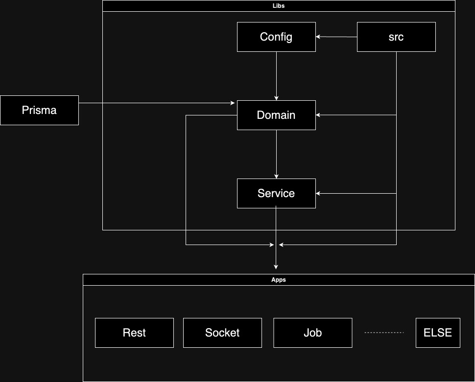

# Boilerplate

### Spec
- Node
  - v20.10
- [NX [Monorepo]](https://nx.dev/)
  - v18
- [Nestjs](https://nestjs.com/)
  - v10
- [Rust [WASM]](https://www.rust-lang.org/)
  - v1.76

### Install
- Rust Install
  - [rustup](https://rustup.rs/) 을 이용한 rust 설치
    - cargo & rustc 를 설치할 수 있다
    - +) [rustfmt](https://github.com/rust-lang/rustfmt)(rust formatter), [clippy](https://github.com/rust-lang/rust-clippy)(linter)
- Run Command `npm install`
- Nx Console for IDE
  - [Vscode](https://marketplace.visualstudio.com/items?itemName=nrwl.angular-console)
  - [Intellij](https://plugins.jetbrains.com/plugin/21060-nx-console)

### Run

- Run Command `npm run wasm:build`
  - init wasm
- Run Command `npm run pg:mig:client`
  - init RDB Schema
- Run Command `npm run pg:gen:client`
  - init prisma client


### Wasm

- rust 의 struct 를 Wasm 으로 생성 이후 호출할 때 객체 자체를 호출하면 메모리 주소를 가르킨다
  - [Ref](https://stackoverflow.com/questions/69694292/how-to-use-exported-struct-in-js-file)

### Structure

Basically One-way-Dependency


<table>
<tr>
<td style="width: 65%"></td>
<td>

- Libs
  - config
  - domain
    - Domain Service
      - Due to the adoption of Prisma by default, there is no Repository, but it can be freely created when using TypeORM or similar tools.
  - service
    - Business Service, You can compose it by combining Domain Service
  - src
    - WASM Code
    - Utils
    - Common library
    - Else...
- Apps
  - You can compose it by combining Service And Domain
- Prisma
  - Domain Schema

</td>
</tr>
</table>


---
### Debug
Debug mode 를 활성화 하기 위해 각 App 의 webpack 의 NxWebpackPlugin 함수 option 으로 sourceMap 옵션 `true` 설정 해야 함

```js
const { NxWebpackPlugin } = require('@nx/webpack');
const CopyPlugin = require('copy-webpack-plugin');
const { join } = require('path');

module.exports = {
  output: {
    path: join(__dirname, '../../dist/apps/api'),
  },
  plugins: [
    new NxWebpackPlugin({
      target: 'node',
      compiler: 'tsc',
      main: './src/main.ts',
      tsConfig: './tsconfig.app.json',
      assets: ['./src/assets'],
      optimization: false,
      outputHashing: 'none',
      sourceMap: true,
    }),
    new CopyPlugin({
      patterns: [
        {
          from: '../../libs/src/wasm/rs_bg.wasm',
          to: '.',
        },
      ],
    }),
  ],
};

```

### Issue

[//]: # (- nestjs 에서 serverless 를 위해 node_module 까지 포함한 bundle 시 밑의 module 을 webpack 에서 ignore 해줘야 한다. <br />)

[//]: # (  하지만 nx.dev 측에서 `new webpack.Ignreplugins` 적용이 되지 않아 다른 방안 대처)

[//]: # (  ```)

[//]: # (     const lazyImports = [)

[//]: # (      '@nestjs/microservices/microservices-module',)

[//]: # (      '@nestjs/websockets/socket-module',)

[//]: # (    ];)

[//]: # (  ```)

[//]: # (  - nx.json 에서 generatePackageJson 옵션을 `trun-on` 후 zip 파일로 압축 후 lambda layer 에 포함 시켜야 할 듯)

[//]: # (  - nx 가 아니라 nestjs 만 사용한다면 custom webpack 이 가능함)


- 기존 Prisma 를 사용하면 relation 이용시 join 쿼리가 아닌 query 를 여러번 호출하여 relation data 를 가져오는 이슈가 있음
  - 이를 해결하기 위해 다음과 같은 방법을 사용할 수 있음
    - prisma `5.9.0` 이상의 버전으로 upgrade 하여 `Relation load strategies` 기능을 사용한다
      - [Doc link](https://www.prisma.io/docs/orm/prisma-client/queries/relation-queries#relation-load-strategies-preview)
    - [kysely](https://kysely.dev/docs/getting-started#types) 라는 query builder 모듈이 있는데 prisma 와 같이 사용할 수 있는 모듈인 [prisma-kysel](https://github.com/valtyr/prisma-kysely) 를 사용 한다

  - Prisma model type 은 relation 의 key 가 정의되어 있지 않기 때문에 relation 이후 type 을 가져올 때 include 를 해야 하는데, 밑의 문서 방법 및 `Prisma.ProjectGetPayload<T>` 를 사용한 type 을 만들어도 2Depth relation 사용 시 순환참조 같은 이슈 발생  
    - [Doc](https://www.prisma.io/docs/orm/prisma-client/type-safety/operating-against-partial-structures-of-model-types)
    - 이후 return type 에 `as unknown as <Definition TYPE>` 형태로 강제 타입변환 시켜야 함
